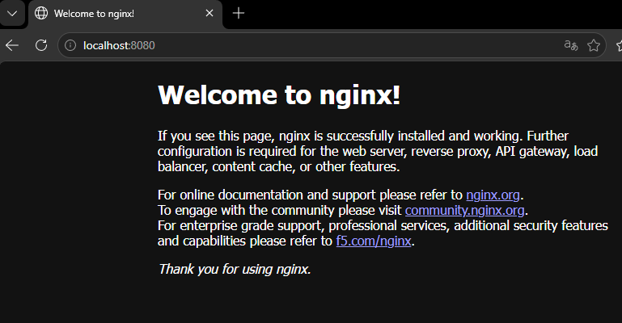
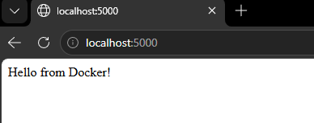

University: [ITMO University](https://itmo.ru/ru/)<br>
Faculty: [FTMI](https://ftmi.itmo.ru/)<br>
Course: [Введение в веб технологии](https://itmo-ict-faculty.github.io/introduction-in-web-tech/)<br>
Year: 2025/2026<br>
Group: U4125<br>
Author: Shishkina Sofya Anatolievna<br>
Lab: Lab0<br>
Date of create: 08.09.2026<br>
Date of finished: 11.09.2026<br>

# Лабораторная работа №1

1. Установка Docker.
	1. В диспетчере задач проверена поддержка виртуализации у процессора: Диспетчер задач -> Производительность -> ЦП -> Виртуализация: включена
	2. C [сайта](https://www.docker.com/products/docker-desktop/) скачан инсталлер Docker Desktop.
	3. Запущен инсталлер и установлен Docker Desktop (с WSL 2 - поддержкой Windows Subsystem for Linux: запуском Linux прямо из консоли Windows).
	4. С помощью `cd` перейдём в папку `lab1`::
	```
	PS ...\introduction-in-web-tech\2026_2027-introduction-in-web-tech-U4125-shishkina_s_a> cd lab1
	PS ...\introduction-in-web-tech\2026_2027-introduction-in-web-tech-U4125-shishkina_s_a\lab1>
	```
	5. Проверена версия Docker с помощью команды `docker --version`:
	```
	Docker version 29.7.2, build a7dcaa6
	```
   6. Запущен тестовый контейнер: `docker run hello-world`:
  ```
	PS ...\2026_2027-introduction-in-web-tech-U4125-shishkina_s_a\lab1> docker run hello-world   
	
Hello from Docker!
This message shows that your installation appears to be working correctly.

To generate this message, Docker took the following steps:
 1. The Docker client contacted the Docker daemon.
 2. The Docker daemon pulled the "hello-world" image from the Docker Hub.
    (amd64)
 3. The Docker daemon created a new container from that image which runs the
    executable that produces the output you are currently reading.
 4. The Docker daemon streamed that output to the Docker client, which sent it
    to your terminal.

To try something more ambitious, you can run an Ubuntu container with:
 $ docker run -it ubuntu bash

Share images, automate workflows, and more with a free Docker ID:
 https://hub.docker.com/

For more examples and ideas, visit:
 https://docs.docker.com/get-started/
```

Сообщение выше означает, что Docker установлен корректно.

	7. Изучены базовые команды: `docker images`, `docker ps`, `docker ps -a`.

- **docker images** показывает список образов Docker, сохранённых локально. Образ - это набор файлов и настроек, из которого создают контейнеры.
	```
	...\introduction-in-web-tech\2026_2027-introduction-in-web-tech-U4125-shishkina_s_a\lab1> docker images

	IMAGE                            ID             DISK USAGE   CONTENT SIZE   EXTRA
	hello-world:latest               5e2309035332       25.9kB         9.49kB    U   
	```

  - `IMAGE` - название и тег образа. Здесь имя образа - `hello-world`, тег - `latest`.
  - `ID` - идентификатор образа, его можно использовать вместо имени.
  - `DISK USAGE` - общий объём данных образа в локальном хранилище Docker (упакованное содержимое и распакованные данные).
  - `CONTENT SIZE` - размер упакованного содержимого образа: сжатых слоёв и служебных данных.
  - `EXTRA` - информация об использовании образа контейнерами. `U` означает, что он используется - `In usage`.

- **docker ps** показывает список запущенных контейнеров Docker. Контейнер — это экземпляр, созданный из образа, с собственным состоянием и процессами.

	```
	PS ...\lab1> docker ps

	CONTAINER ID   IMAGE          COMMAND                  CREATED         STATUS         PORTS                  NAMES
	```

В данном примере список пустой, так как никакие контейнеры не запущены.

- **docker ps -a** показывает список всех существующих контейнеров Docker, включая запущенные и остановленные (a - all).
	```
	PS ...\introduction-in-web-tech\2026_2027-introduction-in-web-tech-U4125-shishkina_s_a\lab1> docker ps -a 
	CONTAINER ID   IMAGE          COMMAND     CREATED          STATUS                      PORTS     NAMES
	95b92375e4c4   hello-world    "/hello"    25 minutes ago   Exited (0) 25 minutes ago             affectionate_noyce
	```
  - `CONTAINER ID` - сокращённый идентификатор контейнера, который можно использовать вместо имени контейнера.
  - `IMAGE` - образ, из которого создан контейнер. Здесь — `hello-world`.
  - `COMMAND` - команда, запускаемая внутри контейнера. Длинные команды могут отображаться в сокращённом виде.
  - `CREATED` - время, прошедшее с момента создания контейнера. Здесь - 25 минут.
  - `STATUS` - текущее состояние контейнера. `Exited (0) 25 minutes ago` означает, что он закончил работу 25 минут назад.
  - `PORTS` - порты контейнера и их привязки к портам компьютера. Данный контейнер не использует порты, поэтому поле пустое.
  - `NAMES` - имя контейнера. Здесь - `affectionate_noyce`. Если имя не задано при создании, Docker назначает его автоматически.

2. Работа с готовыми образами.
   1. Скачан образ Ubuntu:

	```
	PS ...\introduction-in-web-tech\2026_2027-introduction-in-web-tech-U4125-shishkina_s_a\lab1> docker pull ubuntu:latest
	latest: Pulling from library/ubuntu
	08f5f5b2a2b0: Pull complete 
	6a7c4f6d8c38: Pull complete 
	c04a683f373c: Download complete 
	Digest: sha256:513c074113a871b51a8d16ab445c88779d6452d937a164fb5cc479f32668a41d
	Status: Downloaded newer image for ubuntu:latest
	docker.io/library/ubuntu:latest
	```
	2. Запущен интерактивный контейнер:
	```
	PS ...\introduction-in-web-tech\2026_2027-introduction-in-web-tech-U4125-shishkina_s_a\lab1> docker run -it ubuntu bash
	root@dd2e04463fe4:/#
	```

	Консоль `bash` запустилась.

	3. Установлен пакет `curl` внутри контейнера:
	```
	PS ...\introduction-in-web-tech\2026_2027-introduction-in-web-tech-U4125-shishkina_s_a\lab1> docker run -it ubuntu bash
	root@dd2e04463fe4:/# apt update && apt install -y curl
	Ign:1 http://security.ubuntu.com/ubuntu resolute-security InRelease                                    
	Ign:2 http://archive.ubuntu.com/ubuntu resolute InRelease
	Get:3 http://archive.ubuntu.com/ubuntu resolute-updates InRelease [137 kB]
	Get:4 http://archive.ubuntu.com/ubuntu resolute-backports InRelease [137 kB]
	Get:2 http://archive.ubuntu.com/ubuntu resolute InRelease [136 kB]
	Get:5 http://archive.ubuntu.com/ubuntu resolute-updates/restricted amd64 Packages [505 kB]
	Get:6 http://archive.ubuntu.com/ubuntu resolute-updates/main amd64 Packages [745 kB]
	Get:7 http://archive.ubuntu.com/ubuntu resolute-updates/universe amd64 Packages [359 kB]
	Get:8 http://archive.ubuntu.com/ubuntu resolute-updates/multiverse amd64 Packages [14.6 kB]
	Get:9 http://archive.ubuntu.com/ubuntu resolute-backports/universe amd64 Packages [3306 B]
	Get:10 http://archive.ubuntu.com/ubuntu resolute/restricted amd64 Packages [189 kB]
	Get:11 http://archive.ubuntu.com/ubuntu resolute/main amd64 Packages [1874 kB]
	Get:12 http://archive.ubuntu.com/ubuntu resolute/multiverse amd64 Packages [352 kB]
	Get:13 http://archive.ubuntu.com/ubuntu resolute/universe amd64 Packages [20.1 MB]
	Get:1 http://security.ubuntu.com/ubuntu resolute-security InRelease [137 kB]                                                                                                                                                       
	Get:14 http://security.ubuntu.com/ubuntu resolute-security/universe amd64 Packages [212 kB]
	Get:15 http://security.ubuntu.com/ubuntu resolute-security/main amd64 Packages [579 kB]
	Get:16 http://security.ubuntu.com/ubuntu resolute-security/restricted amd64 Packages [493 kB]
	Get:17 http://security.ubuntu.com/ubuntu resolute-security/multiverse amd64 Packages [13.6 kB]
	Fetched 26.0 MB in 1min 50s (237 kB/s)
	7 packages can be upgraded. Run 'apt list --upgradable' to see them.
	Installing:                     
	curl
	
	Installing dependencies:
	bash-completion  libbrotli1   libgnutls30t64    libidn2-0     libkrb5-3        libldap2       libp11-kit0  libsasl2-2           libssh2-1t64   openssl
	ca-certificates  libcurl4t64  libgssapi-krb5-2  libk5crypto3  libkrb5support0  libnettle8t64  libpsl5t64   libsasl2-modules     libtasn1-6     publicsuffix
	krb5-locales     libffi8      libhogweed6t64    libkeyutils1  libldap-common   libnghttp2-14  librtmp1     libsasl2-modules-db  libunistring5
	
	Suggested packages:
	gnutls-bin  krb5-doc  krb5-user  libsasl2-modules-gssapi-mit  | libsasl2-modules-gssapi-heimdal  libsasl2-modules-ldap  libsasl2-modules-otp  libsasl2-modules-sql
	
	Summary:
	Upgrading: 0, Installing: 30, Removing: 0, Not Upgrading: 7
	Download size: 6616 kB
	Space needed: 20.1 MB / 994 GB available
 
	...
 
	debconf: unable to initialize frontend: Dialog
	debconf: (No usable dialog-like program is installed, so the dialog based frontend cannot be used. at /usr/share/perl5/Debconf/FrontEnd/Dialog.pm line 79.)
	debconf: falling back to frontend: Readline
	debconf: unable to initialize frontend: Readline
	debconf: (Can't locate Term/ReadLine.pm in @INC (you may need to install the Term::ReadLine module) (@INC entries checked: /etc/perl /usr/local/lib/x86_64-linux-gnu/perl/5.40.1 /usr/local/share/perl/5.40.1 /usr/lib/x86_64-linux-gnu/perl5/5.40 /usr/share/perl5 /usr/lib/x86_64-linux-gnu/perl-base /usr/lib/x86_64-linux-gnu/perl/5.40 /usr/share/perl/5.40 /usr/local/lib/site_perl) at /usr/share/perl5/Debconf/FrontEnd/Readline.pm line 8.)
	debconf: falling back to frontend: Teletype
	Updating certificates in /etc/ssl/certs...
	121 added, 0 removed; done.
	Setting up libp11-kit0:amd64 (0.26.2-2) ...
	Setting up libgssapi-krb5-2:amd64 (1.22.1-2ubuntu4.1) ...
	Setting up libgnutls30t64:amd64 (3.8.12-2ubuntu1.1) ...
	Setting up libpsl5t64:amd64 (0.21.2-1.1build2) ...
	Setting up librtmp1:amd64 (2.4+20151223.gitfa8646d.1-3) ...
	Setting up libcurl4t64:amd64 (8.18.0-1ubuntu2.5) ...
	Setting up curl (8.18.0-1ubuntu2.5) ...
	Processing triggers for libc-bin (2.43-2ubuntu2.3) ...
	Processing triggers for ca-certificates (20260601~26.04.1) ...
	Updating certificates in /etc/ssl/certs...
	0 added, 0 removed; done.
	Running hooks in /etc/ca-certificates/update.d...
	done.
	```
	
	Установилось много пакетов, поэтому вывод такой большой.

	4. Проверена установка `curl`:
	```
	root@dd2e04463fe4:/# curl --version
	curl 8.18.0 (x86_64-pc-linux-gnu) libcurl/8.18.0 OpenSSL/3.5.5 zlib/1.3.1 brotli/1.2.0 zstd/1.5.7 libidn2/2.3.8 libpsl/0.21.2 libssh2/1.11.1 nghttp2/1.68.0 librtmp/2.3 mit-krb5/1.22.1 OpenLDAP/2.6.10
	Release-Date: 2026-01-07, security patched: 8.18.0-1ubuntu2.5
	Protocols: dict file ftp ftps gopher gophers http https imap imaps ipfs ipns ldap ldaps mqtt pop3 pop3s rtmp rtsp scp sftp smb smbs smtp smtps telnet tftp ws wss
	Features: alt-svc AsynchDNS brotli GSS-API HSTS HTTP2 HTTPS-proxy IDN IPv6 Kerberos Largefile libz NTLM PSL SPNEGO SSL threadsafe TLS-SRP UnixSockets zstd
    ```
 
	5. Совершён выход из контейнера:
	```
	root@dd2e04463fe4:/# exit
	exit
	
	What's next:
	Debug this container error with Gordon → docker ai "help me fix this container error"
	PS ...\introduction-in-web-tech\2026_2027-introduction-in-web-tech-U4125-shishkina_s_a\lab1>
	```

   3. Запуск веб сервера.

      1. Запущен контейнер с `nginx`: 
      ```
      PS ...\introduction-in-web-tech\2026_2027-introduction-in-web-tech-U4125-shishkina_s_a\lab1> docker run -d -p 8080:80 --name web-server nginx:alpine
      Unable to find image 'nginx:alpine' locally
      alpine: Pulling from library/nginx
      6636b9fc203c: Pull complete
      850bf2dcecff: Pull complete
      58c524ea09ce: Pull complete
      51900e10fb9c: Pull complete
      bc98d7675616: Pull complete
      55afa1ecc21d: Pull complete
      8f924cf5086c: Pull complete
      af7dd138f459: Pull complete
      10d8afe205cd: Download complete
      a32eccfe9457: Download complete
      Digest: sha256:72ba65eb42c10344912a84ff42408db7d34f2feb642204570ab8fc5ffd29f1d3
      Status: Downloaded newer image for nginx:alpine
       48469b154764e818e19f34a436cfa8c3da28208bc0f1c48e812fde62dcab1
       ```
  
       Локальный образ не найден, поэтому он был скачан.

       2. Проверена работа в браузере (http://localhost:8080):

       

       3. Просмотрены логи контейнера:
   
       ```
       PS ...\introduction-in-web-tech\2026_2027-introduction-in-web-tech-U4125-shishkina_s_a\lab1> docker logs web-server
       /docker-entrypoint.sh: /docker-entrypoint.d/ is not empty, will attempt to perform configuration
       /docker-entrypoint.sh: Looking for shell scripts in /docker-entrypoint.d/
       /docker-entrypoint.sh: Launching /docker-entrypoint.d/10-listen-on-ipv6-by-default.sh
       10-listen-on-ipv6-by-default.sh: info: Getting the checksum of /etc/nginx/conf.d/default.conf
       10-listen-on-ipv6-by-default.sh: info: Enabled listen on IPv6 in /etc/nginx/conf.d/default.conf
       /docker-entrypoint.sh: Sourcing /docker-entrypoint.d/15-local-resolvers.envsh
       /docker-entrypoint.sh: Launching /docker-entrypoint.d/20-envsubst-on-templates.sh
       /docker-entrypoint.sh: Launching /docker-entrypoint.d/30-tune-worker-processes.sh
       /docker-entrypoint.sh: Configuration complete; ready for start up
       2026/09/11 13:10:30 [notice] 1#1: using the "epoll" event method
       2026/09/11 13:10:30 [notice] 1#1: nginx/1.31.5
       2026/09/11 13:10:30 [notice] 1#1: built by gcc 15.2.0 (Alpine 15.2.0)
       2026/09/11 13:10:30 [notice] 1#1: OS: Linux 6.6.87.2-microsoft-standard-WSL2
       2026/09/11 13:10:30 [notice] 1#1: getrlimit(RLIMIT_NOFILE): 1048576:1048576
       2026/09/11 13:10:30 [notice] 1#1: start worker processes
       2026/09/11 13:10:30 [notice] 1#1: start worker process 30
       2026/09/11 13:10:30 [notice] 1#1: start worker process 31
       2026/09/11 13:10:30 [notice] 1#1: start worker process 32
       2026/09/11 13:10:30 [notice] 1#1: start worker process 33
       2026/09/11 13:10:30 [notice] 1#1: start worker process 34
       2026/09/11 13:10:30 [notice] 1#1: start worker process 35
       2026/09/11 13:10:30 [notice] 1#1: start worker process 36
       2026/09/11 13:10:30 [notice] 1#1: start worker process 37
       2026/09/11 13:10:30 [notice] 1#1: start worker process 38
       2026/09/11 13:10:30 [notice] 1#1: start worker process 39
       2026/09/11 13:10:30 [notice] 1#1: start worker process 40
       2026/09/11 13:10:30 [notice] 1#1: start worker process 41
       172.17.0.1 - - [11/Sep/2026:13:25:40 +0000] "GET / HTTP/1.1" 200 896 "-" "Mozilla/5.0 (Windows NT 10.0; Win64; x64) AppleWebKit/537.36 (KHTML, like Gecko) Chrome/152.0.0.0 Safari/537.36" "-"
       2026/09/11 13:25:40 [error] 31#31: *2 open() "/usr/share/nginx/html/favicon.ico" failed (2: No such file or directory), client: 172.17.0.1, server: localhost, request: "GET /favicon.ico HTTP/1.1", host: "localhost:8080", referrer: "http://localhost:8080/"
       172.17.0.1 - - [11/Sep/2026:13:25:40 +0000] "GET /favicon.ico HTTP/1.1" 404 555 "http://localhost:8080/" "Mozilla/5.0 (Windows NT 10.0; Win64; x64) AppleWebKit/537.36 (KHTML, like Gecko) Chrome/152.0.0.0 Safari/537.36" "-"
       2026/09/11 13:28:08 [error] 32#32: *3 open() "/usr/share/nginx/html/entry" failed (2: No such file or directory), client: 172.17.0.1, server: localhost, request: "GET /entry HTTP/1.1", host: "localhost:8080"
       172.17.0.1 - - [11/Sep/2026:13:28:08 +0000] "GET /entry HTTP/1.1" 404 555 "-" "Mozilla/5.0 (Windows NT 10.0; Win64; x64) AppleWebKit/537.36 (KHTML, like Gecko) Chrome/152.0.0.0 Safari/537.36 Edg/152.0.0.0" "-"
       172.17.0.1 - - [11/Sep/2026:13:28:08 +0000] "GET /favicon.ico HTTP/1.1" 404 555 "http://localhost:8080/entry" "Mozilla/5.0 (Windows NT 10.0; Win64; x64) AppleWebKit/537.36 (KHTML, like Gecko) Chrome/152.0.0.0 Safari/537.36 Edg/152.0.0.0" "-"
       2026/09/11 13:28:08 [error] 32#32: *3 open() "/usr/share/nginx/html/favicon.ico" failed (2: No such file or directory), client: 172.17.0.1, server: localhost, request: "GET /favicon.ico HTTP/1.1", host: "localhost:8080", referrer: "http://localhost:8080/entry"
       172.17.0.1 - - [11/Sep/2026:13:28:11 +0000] "GET / HTTP/1.1" 200 896 "-" "Mozilla/5.0 (Windows NT 10.0; Win64; x64) AppleWebKit/537.36 (KHTML, like Gecko) Chrome/152.0.0.0 Safari/537.36 Edg/152.0.0.0" "-"    
       ```

       4. Произведено подключение к контейнеру:
       ```
       PS ...\introduction-in-web-tech\2026_2027-introduction-in-web-tech-U4125-shishkina_s_a\lab1> docker exec -it web-server sh
       / #
       ```
      
       Загрузилась внутренняя консоль контейнера. Выйдем из неё:
	   ```
       / # exit

	   What's next:
       Try Docker Debug for seamless, persistent debugging tools in any container or image → docker debug web-server
       Learn more at https://docs.docker.com/go/debug-cli/
       PS ...\introduction-in-web-tech\2026_2027-introduction-in-web-tech-U4125-shishkina_s_a\lab1>
       ```
   
4. Управление контейнерами.

	1. Просмотрены запущенные контейнеры:
   ```
   PS ...\introduction-in-web-tech\2026_2027-introduction-in-web-tech-U4125-shishkina_s_a\lab1> docker ps
   CONTAINER ID   IMAGE          COMMAND                  CREATED          STATUS          PORTS                                     NAMES
   3248469b154   nginx:alpine   "/docker-entrypoint.…"   25 minutes ago   Up 25 minutes   0.0.0.0:8080->80/tcp, [::]:8080->80/tcp   web-server
   ```
   В этот раз результат непустой, так как запущен один контейнер `nginx`. Поле `PORTS` здесь тоже непустое. `0.0.0.0:8080->80/tcp, [::]:8080->80/tcp` означает, что внутренний порт контейнера 8080 соединён с внешним портом 80, поэтому по адресу http://localhost:8080 загружалась страница.

	2. Просмотрены все контейнеры:
   ```
   PS ...\introduction-in-web-tech\2026_2027-introduction-in-web-tech-U4125-shishkina_s_a\lab1> docker ps -a
   CONTAINER ID   IMAGE           COMMAND                  CREATED             STATUS                         PORTS                                     NAMES
   32f48469b154   nginx:alpine    "/docker-entrypoint.…"   28 minutes ago      Up 28 minutes                  0.0.0.0:8080->80/tcp, [::]:8080->80/tcp   web-server
   dd2e04463fe4   ubuntu          "bash"                   47 minutes ago      Exited (130) 29 minutes ago                                              intelligent_blackwell
   95b92375e4c4   hello-world     "/hello"                 About an hour ago   Exited (0) About an hour ago                                             affectionate_noyce
   ```
	Видно уже 3 контейнера - именно столько было запущено выше.

	3. Остановлен контейнер `web-server`:
   ```
   PS ...\introduction-in-web-tech\2026_2027-introduction-in-web-tech-U4125-shishkina_s_a\lab1> docker stop web-server
   web-server
   ```
   4. Запущен остановленный контейнер:
   ```
   PS ...\introduction-in-web-tech\2026_2027-introduction-in-web-tech-U4125-shishkina_s_a\lab1> docker start web-server
   web-server
   ```
   5. Попытка удалить контейнер:
   ```
   PS ...\introduction-in-web-tech\2026_2027-introduction-in-web-tech-U4125-shishkina_s_a\lab1> docker rm web-server
   Error response from daemon: cannot remove container "web-server": container is running: stop the container before removing or force remove
   ```
   Это не сработало, так как контейнер был запущен - запущенные контейнеры удалять нельзя.
	
	Контейнер остановлен и удалён:
	```
    PS ...\introduction-in-web-tech\2026_2027-introduction-in-web-tech-U4125-shishkina_s_a\lab1> docker stop web-server
    web-server
    PS ...\introduction-in-web-tech\2026_2027-introduction-in-web-tech-U4125-shishkina_s_a\lab1> docker rm web-server
    web-server
    ```

	6. Образ удалён:
    ```
    PS ...\introduction-in-web-tech\2026_2027-introduction-in-web-tech-U4125-shishkina_s_a\lab1> docker rmi nginx:alpine
    Untagged: nginx:alpine
    Deleted: sha256:72ba65eb42c10344912a84ff42408db7d34f2feb642204570ab8fc5ffd29f1d3
    ```
   
5. Работа с томами (volumes).

	1. Создан том:
    ```
   PS ...\introduction-in-web-tech\2026_2027-introduction-in-web-tech-U4125-shishkina_s_a\lab1> docker volume create my-volume
    my-volume
   ```
   
	2. С созданным томом запущен контейнер:
   ```
   PS ...\introduction-in-web-tech\2026_2027-introduction-in-web-tech-U4125-shishkina_s_a\lab1> docker run -it --name volume-test -d -v my-volume:/data ubuntu bash
   291b1738c8482311c9153f514b806711c068af342c03f4b9b1b10c91702d4844
   ```
   
	3. Произведено подключение к контейнеру:
   ```
   PS ...\introduction-in-web-tech\2026_2027-introduction-in-web-tech-U4125-shishkina_s_a\lab1> docker exec -it volume-test bash
   root@291b1738c848:/#
   ```
   
	4. В томе создан файл:
	```
    echo "Hello from volume" > /data/test.txt
 	```
 
	5. Удалён контейнер и создан новый с тем же томом (volume-test-2):
   ```
    PS ...\introduction-in-web-tech\2026_2027-introduction-in-web-tech-U4125-shishkina_s_a\lab1> docker stop volume-test
    volume-test
    PS ...\introduction-in-web-tech\2026_2027-introduction-in-web-tech-U4125-shishkina_s_a\lab1> docker rm volume-test
    volume-test
    PS ...\introduction-in-web-tech\2026_2027-introduction-in-web-tech-U4125-shishkina_s_a\lab1> docker run -it --name volume-test-2 -d -v my-volume:/data ubuntu bash
    c6b2cf969921fe75a7bf2ad6e8dcda76302269b9300beb1aa4495c9e1def26da
   ```
   
	6. Произведена проверка того, что файл сохранился.
   Для этого подключимся к контейнеру, как делали это с `web-server`:

	```
	PS ...\introduction-in-web-tech\2026_2027-introduction-in-web-tech-U4125-shishkina_s_a\lab1> docker exec -it volume-test-2 sh
	# 
	```
    
    Просмотрено содержимое с помощью `dir`:

    ```
   # dir
   bin  boot  data  dev  etc  home  lib  lib64  media  mnt  opt  proc  root  run  sbin  srv  sys  tmp  usr  var
   ```
   
    Произведен переход в директорию `data`  с помощью `cd` и просмотрено её содержимое с помощью `dir`:

   ```
    # cd data
    # dir
    test.txt
   ```
    
    Видно, что файл `test.txt` сохранился.

# Лабораторная работа №1 со звёздочкой

1. Создание файлов проекта.

- `app.py`:

```python
from flask import Flask

app = Flask(__name__)


@app.route('/')
def hello():
    return "Hello from Docker!"


if __name__ == '__main__':
    app.run(host='0.0.0.0', port=5000)
```
Это исходный код простого веб-сервера, который показывает текст "Hello from Docker!".

- requirements.txt:

```
Flask==2.0.1
Werkzeug==2.0.3
```

Это файл с описанием зависимостей: `Flask` версии 2.0.1 и совместимая с ним версия `Werkzeug` 2.0.3. Причина фиксации Werkzeug объясняется ниже.
 
2. Создан `Dockerfile` со следующими условиями:
   1. Использовн базовый образ `python:3.9-slim`
   ```FROM python:3.9-slim```
   2. Установлена рабочую директорию `/app`

    ```WORKDIR /app```
   3. Установлены системные пакеты: `curl` и `vim`
    ```
   RUN apt-get update \
    && apt-get install -y curl vim
   ```
   4. Установлен Python пакеты из файла `requirements.txt`. Для этого сначала файл `requirements.txt` скопирован в образ, а потом установлены зависимости:
   ```
   COPY requirements.txt .
   RUN pip install --no-cache-dir -r requirements.txt
   ```
   5. Скопирован файл `app.py` в контейнер
   ```
   COPY app.py .
   ```
   6. Создан пользователя appuser с UID 1000
   ```
   RUN useradd --create-home --uid 1000 appuser
   ```
   7. Совершено переключение на пользователя `appuser`
   ```
   USER appuser
   ```
   8. Открыт порт 5000
   ```
   EXPOSE 5000
   ```
   9. Установлена переменная окружения `FLASK_ENV=production`
   ```
   ENV FLASK_ENV=production
   ```
   10. Запущено приложение командой `python app.py`:
   ```
   CMD ["python", "app.py"]
   ```
   
Итоговый `Dockerfile`:

```
FROM python:3.9-slim

WORKDIR /app

RUN apt-get update \
    && apt-get install -y curl vim

COPY requirements.txt .
   RUN pip install --no-cache-dir -r requirements.txt

COPY app.py .

RUN useradd --create-home --uid 1000 appuser

USER appuser

EXPOSE 5000

ENV FLASK_ENV=production

CMD ["python", "app.py"]
```

3. Проверка работы
- Собран образ:
```
[2026-09-11 19:32:42] PS C:\Users\r0mberg\Documents\Dev\introduction-in-web-tech\2026_2027-introduction-in-web-tech-U4125-shishkina_s_a\lab1> docker build -t my-flask-app .
[+] Building 20.6s (12/12) FINISHED                                                                                                                                                                            docker:desktop-linux
 => [internal] load build definition from Dockerfile                                                                                                                                                                           0.0s
 => => transferring dockerfile: 349B                                                                                                                                                                                           0.0s
 => [internal] load metadata for docker.io/library/python:3.9-slim                                                                                                                                                             1.4s
 => [internal] load .dockerignore                                                                                                                                                                                              0.0s
 => => transferring context: 2B                                                                                                                                                                                                0.0s
 => [1/7] FROM docker.io/library/python:3.9-slim@sha256:2d97f6910b16bd338d3060f261f53f144965f755599aab1acda1e13cf1731b1b                                                                                                       0.0s
 => => resolve docker.io/library/python:3.9-slim@sha256:2d97f6910b16bd338d3060f261f53f144965f755599aab1acda1e13cf1731b1b                                                                                                       0.0s
 => [internal] load build context                                                                                                                                                                                              0.0s
 => => transferring context: 86B                                                                                                                                                                                               0.0s
 => CACHED [2/7] WORKDIR /app                                                                                                                                                                                                  0.0s
 => [3/7] RUN apt-get update     && apt-get install -y curl vim                                                                                                                                                               10.5s
 => [4/7] COPY requirements.txt .                                                                                                                                                                                              0.1s 
 => [5/7] RUN pip install --no-cache-dir -r requirements.txt                                                                                                                                                                   4.1s 
 => [6/7] COPY app.py .                                                                                                                                                                                                        0.1s 
 => [7/7] RUN useradd --create-home --uid 1000 appuser                                                                                                                                                                         0.3s 
 => exporting to image                                                                                                                                                                                                         3.9s 
 => => exporting layers                                                                                                                                                                                                        2.5s 
 => => exporting manifest sha256:a32746491ef380ae15a496f00197729247a4651c50092e74cebf863e54d5d360                                                                                                                              0.0s 
 => => exporting config sha256:f62549a2660f4bba172ee2dc2bd09d7b66c9fbce7bd9388791e7888b987b1b71                                                                                                                                0.0s 
 => => exporting attestation manifest sha256:beb284d3edc5d65c1b1a622f4706c22f4aac7d3c33674a186c7ea3f6529571ae                                                                                                                  0.0s
 => => exporting manifest list sha256:dccbaeb9bbe808f7a4c6968f5af83e006aacdf40945eb327addd4d35e42ddb16                                                                                                                         0.0s
 => => naming to docker.io/library/my-flask-app:latest                                                                                                                                                                         0.0s
 => => unpacking to docker.io/library/my-flask-app:latest                                                                                                                                                                      1.2s
```

Проверка того, что образ есть:
```
PS ...\introduction-in-web-tech\2026_2027-introduction-in-web-tech-U4125-shishkina_s_a\lab1> docker images
                                                                                                                                                                                                                i Info →   U  In Use
IMAGE                            ID             DISK USAGE   CONTENT SIZE   EXTRA
my-flask-app:latest              dccbaeb9bbe8        327MB         85.8MB        
```

- Запущен контейнер:
```
PS ...\introduction-in-web-tech\2026_2027-introduction-in-web-tech-U4125-shishkina_s_a\lab1> docker run -d -p 5000:5000 --name flask-container my-flask-app                   
7298db77e803cb2499a20ffd8d0fb1ca0cd8cd98b4e909a13e0934ea379878bf
```

- Проверена его работа:
```
PS introduction-in-web-tech\2026_2027-introduction-in-web-tech-U4125-shishkina_s_a\lab1> curl http://localhost:5000
curl : Невозможно соединиться с удаленным сервером
строка:1 знак:1
+ curl http://localhost:5000
+ ~~~~~~~~~~~~~~~~~~~~~~~~~~
    + CategoryInfo          : InvalidOperation: (System.Net.HttpWebRequest:HttpWebRequest) [Invoke-WebRequest], WebException
    + FullyQualifiedErrorId : WebCmdletWebResponseException,Microsoft.PowerShell.Commands.InvokeWebRequestCommand
```

Контейнер не заработал. Для того, чтобы понять, в чём проблема, были проверены логи контейнера:
```
PS ...\introduction-in-web-tech\2026_2027-introduction-in-web-tech-U4125-shishkina_s_a\lab1> docker logs flask-container
Traceback (most recent call last):
  File "/app/app.py", line 1, in <module>
    from flask import Flask
  File "/usr/local/lib/python3.9/site-packages/flask/__init__.py", line 7, in <module>
    from .app import Flask as Flask
  File "/usr/local/lib/python3.9/site-packages/flask/app.py", line 28, in <module>
    from . import cli
  File "/usr/local/lib/python3.9/site-packages/flask/cli.py", line 18, in <module>
    from .helpers import get_debug_flag
  File "/usr/local/lib/python3.9/site-packages/flask/helpers.py", line 16, in <module>
    from werkzeug.urls import url_quote
ImportError: cannot import name 'url_quote' from 'werkzeug.urls' (/usr/local/lib/python3.9/site-packages/'url_quote' from 'werkzeug.urls'/urls.py)
```

Ошибка означает, что версия `Flask=2.0.1` требует `'url_quote' from 'werkzeug.urls'`, а текущая версия зависимости `werkzeug` её не содержит. Исправим, добавив зависимость `Werkzeug==2.0.3`.

Так как зависимости - часть образа, нужно его пересобрать, а потом снова запустить контейнер.

Собран новый образ:
```
PS ...\introduction-in-web-tech\2026_2027-introduction-in-web-tech-U4125-shishkina_s_a\lab1> docker build -t my-flask-app .
[+] Building 6.9s (12/12) FINISHED                                                                                                                                                                             docker:desktop-linux
 => [internal] load build definition from Dockerfile                                                                                                                                                                           0.0s
 => => transferring dockerfile: 349B                                                                                                                                                                                           0.0s
 => [internal] load metadata for docker.io/library/python:3.9-slim                                                                                                                                                             1.1s
 => [internal] load .dockerignore                                                                                                                                                                                              0.0s
 => => transferring context: 2B                                                                                                                                                                                                0.0s
 => [1/7] FROM docker.io/library/python:3.9-slim@sha256:2d97f6910b16bd338d3060f261f53f144965f755599aab1acda1e13cf1731b1b                                                                                                       0.0s
 => => resolve docker.io/library/python:3.9-slim@sha256:2d97f6910b16bd338d3060f261f53f144965f755599aab1acda1e13cf1731b1b                                                                                                       0.0s
 => [internal] load build context                                                                                                                                                                                              0.0s
 => => transferring context: 102B                                                                                                                                                                                              0.0s
 => CACHED [2/7] WORKDIR /app                                                                                                                                                                                                  0.0s
 => CACHED [3/7] RUN apt-get update     && apt-get install -y curl vim                                                                                                                                                         0.0s 
 => [4/7] COPY requirements.txt .                                                                                                                                                                                              0.0s 
 => [5/7] RUN pip install --no-cache-dir -r requirements.txt                                                                                                                                                                   4.3s 
 => [6/7] COPY app.py .                                                                                                                                                                                                        0.0s 
 => [7/7] RUN useradd --create-home --uid 1000 appuser                                                                                                                                                                         0.4s 
 => exporting to image                                                                                                                                                                                                         0.9s 
 => => exporting layers                                                                                                                                                                                                        0.5s 
 => => exporting manifest sha256:ec3ab5a4f4167a7c2964e1d6fc0a986a85ec2bef9428e625c4d2566b6c654ebf                                                                                                                              0.0s
 => => exporting config sha256:b1cc371cbef5c1d7e1d9dcfe56737b7bdf37ed3bc142e7ec1fa979857a3e6796                                                                                                                                0.0s 
 => => exporting attestation manifest sha256:1a5e1be5812b171ef80ab5058481dd3b9bc991ee051915826922d81abeff560b                                                                                                                  0.0s 
 => => exporting manifest list sha256:573ebf5733ec364b5b6592245824625ab024c348155dbea6576fe1542100179f                                                                                                                         0.0s 
 => => naming to docker.io/library/my-flask-app:latest                                                                                                                                                                         0.0s 
 => => unpacking to docker.io/library/my-flask-app:latest                                                                                                                                                                      0.3s 
                                                                                                                                                                                                                                    
View build details: docker-desktop://dashboard/build/desktop-linux/desktop-linux/aad9wayi2oe7b25m8ld1mprmg
```

Удалён старый контейнер `flask-container` и запущен новый:

```
PS ...\introduction-in-web-tech\2026_2027-introduction-in-web-tech-U4125-shishkina_s_a\lab1> docker rm flask-container
flask-container
PS ...\introduction-in-web-tech\2026_2027-introduction-in-web-tech-U4125-shishkina_s_a\lab1> docker run -d -p 5000:5000 --name flask-container my-flask-app
dac7d2d51762c2aa2ce0d114fb20234d9ea325f2cac22b761fa8a27b8ae509bc
```

Проверена его работоспособность через `curl`:

```
PS ...\introduction-in-web-tech\2026_2027-introduction-in-web-tech-U4125-shishkina_s_a\lab1> curl http://localhost:5000

Предупреждение безопасности: риск выполнения сценария
Invoke-WebRequest анализирует содержимое веб-страницы. При анализе страницы может выполняться код сценария на веб-странице.
      РЕКОМЕНДУЕМОЕ ДЕЙСТВИЕ:
      Используйте параметр -UseBasicParsing, чтобы предотвратить выполнение кода сценария.

      Продолжить?
    
[Y] Да - Y  [A] Да для всех - A  [N] Нет - N  [L] Нет для всех - L  [S] Приостановить - S  [?] Справка (значением по умолчанию является "N"): y


StatusCode        : 200
StatusDescription : OK
Content           : Hello from Docker!
RawContent        : HTTP/1.0 200 OK
                    Content-Length: 18
                    Content-Type: text/html; charset=utf-8
                    Date: Fri, 11 Sep 2026 16:46:32 GMT
                    Server: Werkzeug/2.0.3 Python/3.9.25
                    
                    Hello from Docker!
Forms             : {}
Headers           : {[Content-Length, 18], [Content-Type, text/html; charset=utf-8], [Date, Fri, 11 Sep 2026 16:46:32 GMT], [Server, Werkzeug/2.0.3 Python/3.9.25]}
Images            : {}
InputFields       : {}
Links             : {}
ParsedHtml        : mshtml.HTMLDocumentClass
RawContentLength  : 18
```

Вернулся ответ, содержащий текст "Hello from Docker!" - то что и нужно.

Проверим то же самое в браузере:




