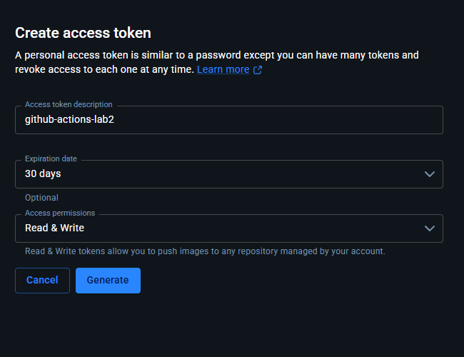
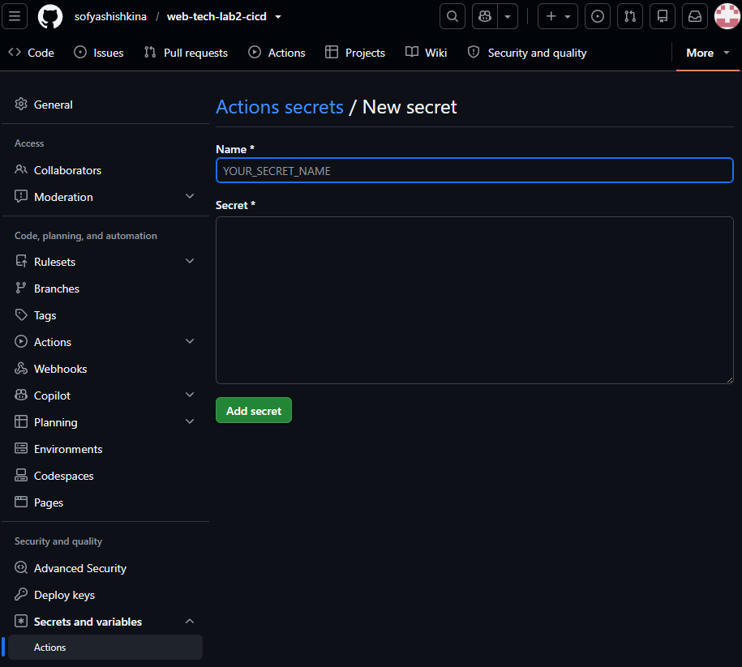
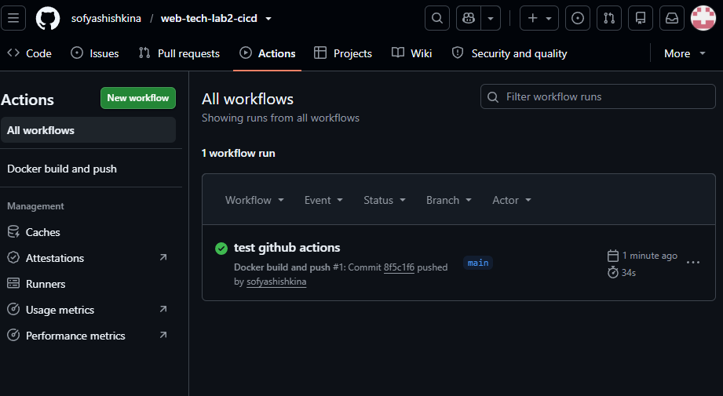
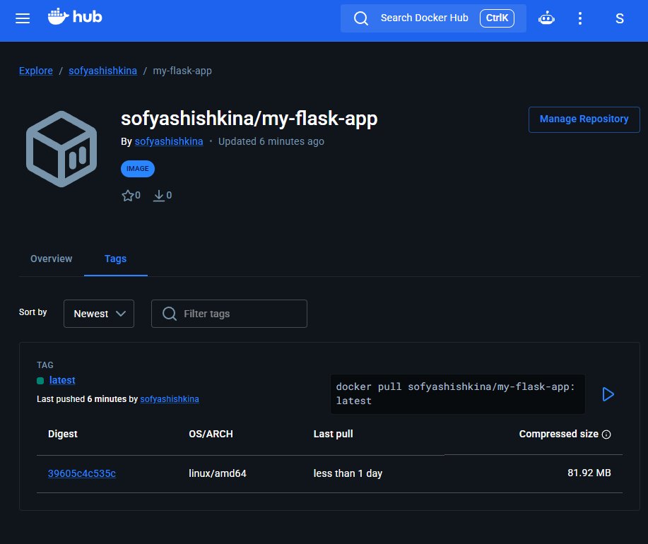
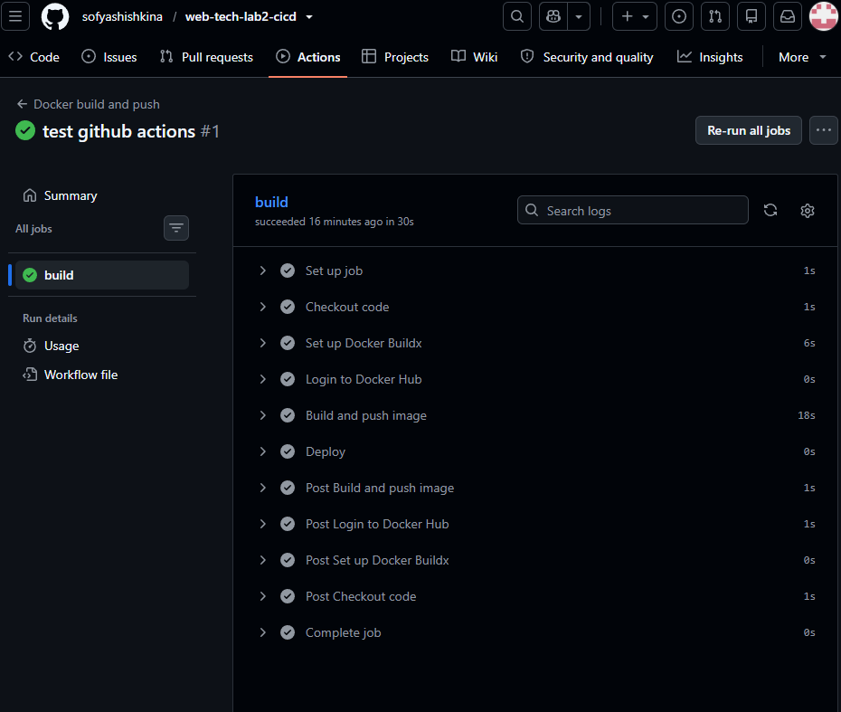

University: [ITMO University](https://itmo.ru/ru/)<br>
Faculty: [FTMI](https://ftmi.itmo.ru/)<br>
Course: [Введение в веб технологии](https://itmo-ict-faculty.github.io/introduction-in-web-tech/)<br>
Year: 2025/2026<br>
Group: U4125<br>
Author: Shishkina Sofya Anatolievna<br>
Lab: Lab1<br>
Date of create: 12.09.2026<br>
Date of finished: -<br>

# Лабораторная работа №2

## Описание

Лабораторная работа по настройке CI/CD пайплайна для автоматической сборки, публикации и деплоя Docker образа из первой лабораторной работы.

## Цель работы

Научиться настраивать автоматизированные пайплайны для сборки Docker образов, их публикации в registry и автоматического деплоя при изменении кода.

## Ход работы

### Обычная лабораторная работа. Настройка CI/CD пайплайна с GitHub Actions

1. Подготовка проекта.

- Скопировать файлы из первой лабораторной (app.py, requirements.txt, Dockerfile) в новый репозиторий. 

Создан [отдельный репозиторий](https://github.com/sofyashishkina/web-tech-lab2-cicd) с файлами из первой лабораторной.

- Создать аккаунт на Docker Hub (если нет).

Создан [аккаунт](https://hub.docker.com/repositories/sofyashishkina).

- Создать новый репозиторий на Docker Hub для вашего образа.

Создан [новый репозиторий](https://hub.docker.com/repository/docker/sofyashishkina/my-flask-app/general) на Docker Hub.

2. Настройка GitHub Actions.

- Создать папку .github/workflows/ в корне проекта.

В корне [проекта](https://github.com/sofyashishkina/web-tech-lab2-cicd) создана папка `.github/workflows/`.

- Создать файл `docker-build.yml` с пайплайном, который должен:
    - Запускаться при пуше в main ветку
    - Использовать Ubuntu как runner
    - Выполнять checkout кода
    - Настраивать Docker Buildx
    - Логиниться в Docker Hub используя секреты
    - Собирать и пушить образ с тегом username/my-flask-app:latest
    - Добавлять шаг деплоя (можно просто echo сообщение)

Итоговый файл:
```
name: Docker build and push

on:
  push:
    branches:
      - main

jobs:
  build:
    runs-on: ubuntu-latest

    steps:
      - name: Checkout code
        uses: actions/checkout@v7

      - name: Set up Docker Buildx
        uses: docker/setup-buildx-action@v4

      - name: Login to Docker Hub
        uses: docker/login-action@v4
        with:
          username: ${{ secrets.DOCKER_USERNAME }}
          password: ${{ secrets.DOCKER_PASSWORD }}

      - name: Build and push image
        uses: docker/build-push-action@v7
        with:
          context: .
          push: true
          tags: ${{ secrets.DOCKER_USERNAME }}/my-flask-app:latest

      - name: Deploy
        run: echo "Deploying application..."
```

  Объяснение содержимого `docker-build.yml`:
  - `Docker build and push` - название процесса во вкладке Actions;
  - `on` - условия запуска;
  - `push:` - запуск после отправки коммитов в GitHub;
  - `branches: - main` - запуск только для ветки main;
  - `jobs:` - список заданий;
  - `build:` - идентификатор задания;
  - `runs-on: ubuntu-latest` - выполнение на Ubuntu;
  - `steps:` - шаги задания;
  - `name:` (внутри `steps`) - название шага;
  - `uses:` - название готового действия, которое будет использоваться на этом шаге;
  - `with:` - параметры шага;
  - `run:` - команда, выполняемая в этом шаге.

  Шаги (`steps`):
  - `Checkout code` - скачивает исходный код нужного коммита на runner. В нашем случае это `Dockerfile`, `app.py` и `requirements.txt`.
  - `Set up Docker Buildx` - подготовка инструмента сборки Docker-образов;
  - `Login to Docker Hub` - авторизация на Docker Hub (с использованием секретов, который будут добавлены далее);
  - `Build and push image` - сборка и отправка (`push: true`) образа на Docker Hub. `context: .` означает, что для сборки используется корень скачанно репозитория, `tags:` - имя и тег образа.
  - `Deploy` - развёртывание. В нашем случае используется ненастоящее развёртываение, при котором на экран просто печатается `"Deploying application..."`.

3. Настройка секретов.
 - В настройках GitHub репозитория добавить секреты:
    - `DOCKER_USERNAME` - ваш логин на Docker Hub
    - `DOCKER_PASSWORD` - ваш пароль или токен доступа Docker Hub

Для публикаций образов создадим токен. Для этого перейдём: `Account settings -> Personal access tokens -> Generate new token`:



Создан токен `github-actions-lab2`, действующий 30 дней с правом чтения и записи. Создадим секрет с названием `DOCKER_PASSWORD` в [репозитории GitHub](https://github.com/sofyashishkina/web-tech-lab2-cicd):



Аналогично с `DOCKER_USERNAME`.

4. Тестирование пайплайна.
  - Сделать коммит и пуш в main ветку.

Посмотрим, что не закомичено:
```
PS ...\introduction-in-web-tech\web-tech-lab2-cicd> git status
On branch main
Your branch is up to date with 'origin/main'.

Untracked files:
  (use "git add <file>..." to include in what will be committed)
        .github/

nothing added to commit but untracked files present (use "git add" to track)
```

Незакомичена папка `.github`. Добавим её в коммит и сделаем `push`:

```
PS ...\introduction-in-web-tech\web-tech-lab2-cicd> git add -A
PS ...\introduction-in-web-tech\web-tech-lab2-cicd> git commit -m"test github actions"
[main 8f5c1f6] test github actions
 1 file changed, 33 insertions(+)
 create mode 100644 .github/workflows/docker-build.yml
PS ...\introduction-in-web-tech\web-tech-lab2-cicd> git push
Enumerating objects: 6, done.
Counting objects: 100% (6/6), done.
Delta compression using up to 12 threads
Compressing objects: 100% (3/3), done.
Writing objects: 100% (5/5), 695 bytes | 695.00 KiB/s, done.
Total 5 (delta 1), reused 0 (delta 0), pack-reused 0 (from 0)
remote: Resolving deltas: 100% (1/1), completed with 1 local object.
To https://github.com/sofyashishkina/web-tech-lab2-cicd
   be30b07..8f5c1f6  main -> main
```

- Проверить выполнение пайплайна в разделе Actions.

Перейдём в раздел Actions на GitHub:



Видим в списке Workflows успешно выполненный Action с текстом коммита "test github actions", как и было указано.

- Убедиться, что образ появился в Docker Hub.

Перейдём на страницу тегов репозитория - видим `latest`:



Образ появился в Docker Hub.

- Проверить логи выполнения каждого шага.

Для этого на странице GitHub Actions нажмём на build (название job, который описан в `docker-build.yml`):



Раскроем каждый шаг и видим логи:


```
Set up job

Current runner version: '2.337.0'
Runner Image Provisioner
Operating System
Runner Image
GITHUB_TOKEN Permissions
Secret source: Actions
Cache mode: write
Prepare workflow directory
Prepare all required actions
Getting action download info
Download action repository 'actions/checkout@v7' (SHA:3d3c42e5aac5ba805825da76410c181273ba90b1)
Download action repository 'docker/setup-buildx-action@v4' (SHA:37fe631027851001ddb9b187196cc803df7f5f0e)
Download action repository 'docker/login-action@v4' (SHA:dbcb813823bdd20940b903addbd779551569679f)
Download action repository 'docker/build-push-action@v7' (SHA:53b7df96c91f9c12dcc8a07bcb9ccacbed38856a)
Complete job name: build
```

```
Checkout code

Run actions/checkout@v7
Syncing repository: ***/web-tech-lab2-cicd
Getting Git version info
Temporarily overriding HOME='/home/runner/work/_temp/81e9fe6b-bc54-45c3-a587-29a9894541cf' before making global git config changes
Adding repository directory to the temporary git global config as a safe directory
/usr/bin/git config --global --add safe.directory /home/runner/work/web-tech-lab2-cicd/web-tech-lab2-cicd
Deleting the contents of '/home/runner/work/web-tech-lab2-cicd/web-tech-lab2-cicd'
Determining repository object format
Initializing the repository
Disabling automatic garbage collection
Setting up auth
Fetching the repository
Determining the checkout info
/usr/bin/git sparse-checkout disable
/usr/bin/git config --local --unset-all extensions.worktreeConfig
Checking out the ref
/usr/bin/git log -1 --format=%H
8f5c1f61c9f080ad39330b9f8b851e68f4fc2744
```

```
Set up Docker Buildx

Run docker/setup-buildx-action@v4
Docker info
Buildx version
Inspecting default docker context
Creating a new builder instance
Booting builder
Inspect builder
BuildKit version
```

```
Login to Docker Hub

Run docker/login-action@v4
Logging into docker.io...
Login Succeeded!
```

```
Build and push image

Run docker/build-push-action@v7
GitHub Actions runtime token ACs
Docker info
Proxy configuration
Buildx version
Builder info
/usr/bin/docker buildx build --iidfile /home/runner/work/_temp/docker-actions-toolkit-pAc6MV/build-iidfile-48bf40094e.txt --attest type=provenance,mode=max,builder-id=https://github.com/***/web-tech-lab2-cicd/actions/runs/34718732033/attempts/1 --tag ***/my-flask-app:latest --metadata-file /home/runner/work/_temp/docker-actions-toolkit-pAc6MV/build-metadata-3b92d1feac.json --push .
#0 building with "builder-7609d669-3729-4fe7-b48f-1b449401e844" instance using docker-container driver

#1 [internal] load build definition from Dockerfile
#1 transferring dockerfile: 349B 0.0s done
#1 DONE 0.0s

#2 [auth] library/python:pull token for registry-1.docker.io
#2 DONE 0.0s

#3 [internal] load metadata for docker.io/library/python:3.9-slim
#3 DONE 0.4s

#4 [internal] load .dockerignore
#4 transferring context: 2B done
#4 DONE 0.0s

#5 [internal] load build context
#5 transferring context: 287B done
#5 DONE 0.0s

#6 [1/7] FROM docker.io/library/python:3.9-slim@sha256:2d97f6910b16bd338d3060f261f53f144965f755599aab1acda1e13cf1731b1b
#6 resolve docker.io/library/python:3.9-slim@sha256:2d97f6910b16bd338d3060f261f53f144965f755599aab1acda1e13cf1731b1b done
#6 sha256:ea56f685404adf81680322f152d2cfec62115b30dda481c2c450078315beb508 251B / 251B 0.0s done
#6 sha256:b3ec39b36ae8c03a3e09854de4ec4aa08381dfed84a9daa075048c2e3df3881d 1.29MB / 1.29MB 0.1s done
#6 sha256:fc74430849022d13b0d44b8969a953f842f59c6e9d1a0c2c83d710affa286c08 13.88MB / 13.88MB 0.1s done
#6 sha256:38513bd7256313495cdd83b3b0915a633cfa475dc2a07072ab2c8d191020ca5d 29.78MB / 29.78MB 0.1s done
#6 extracting sha256:38513bd7256313495cdd83b3b0915a633cfa475dc2a07072ab2c8d191020ca5d
#6 extracting sha256:38513bd7256313495cdd83b3b0915a633cfa475dc2a07072ab2c8d191020ca5d 0.7s done
#6 DONE 0.8s

#6 [1/7] FROM docker.io/library/python:3.9-slim@sha256:2d97f6910b16bd338d3060f261f53f144965f755599aab1acda1e13cf1731b1b
#6 extracting sha256:b3ec39b36ae8c03a3e09854de4ec4aa08381dfed84a9daa075048c2e3df3881d 0.1s done
#6 extracting sha256:fc74430849022d13b0d44b8969a953f842f59c6e9d1a0c2c83d710affa286c08
#6 extracting sha256:fc74430849022d13b0d44b8969a953f842f59c6e9d1a0c2c83d710affa286c08 0.4s done
#6 DONE 1.4s

#6 [1/7] FROM docker.io/library/python:3.9-slim@sha256:2d97f6910b16bd338d3060f261f53f144965f755599aab1acda1e13cf1731b1b
#6 extracting sha256:ea56f685404adf81680322f152d2cfec62115b30dda481c2c450078315beb508 done
#6 DONE 1.4s

#7 [2/7] WORKDIR /app
#7 DONE 0.1s
...
...
...
```

```
Deploy

Run echo "Deploying application..."
Deploying application...
```

```
Post Build and push image

Post job cleanup.
Generating build summary
Removing temp folder /home/runner/work/_temp/docker-actions-toolkit-pAc6MV
Post cache
```

```
Post Set up Docker Buildx

...
```

```
Post Checkout code

...
```

```
Complete job

Cleaning up orphan processes
```