University: [ITMO University](https://itmo.ru/ru/)<br>
Faculty: [FTMI](https://ftmi.itmo.ru/)<br>
Course: [Введение в веб технологии](https://itmo-ict-faculty.github.io/introduction-in-web-tech/)<br>
Year: 2025/2026<br>
Group: U4125<br>
Author: Shishkina Sofya Anatolievna<br>
Lab: Lab1<br>
Date of create: 14.09.2026<br>
Date of finished: -<br>

# Лабораторная работа №3

## Описание

Лабораторная работа по настройке системы мониторинга с использованием Prometheus для сбора метрик и Grafana для визуализации данных.

## Цель работы

Научиться настраивать локальную систему мониторинга, собирать метрики с помощью Prometheus и создавать дашборды в Grafana для визуализации данных.
## Ход работы

### Обычная лабораторная работа. Настройка мониторинга с Prometheus и Grafana

1. Создание конфигурации Prometheus.

- Создать папку `prometheus` для конфигурации

Создадим папку внутри папки `lab3`.

- Создать файл `prometheus/prometheus.yml` со следующим содержимым:
```
global:
  scrape_interval: 15s

scrape_configs:
  - job_name: 'prometheus'
    static_configs:
      - targets: ['localhost:9090']
  - job_name: 'node-exporter'
    static_configs:
      - targets: ['node-exporter:9100']
```
    
Создадим описанный файл.

2. Запуск Node Exporter.

- Запустить контейнер Node Exporter для сбора системных метрик:
```
docker run -d \
      --name node-exporter \
      --restart=unless-stopped \
      -p 9100:9100 \
      -v "/proc:/host/proc:ro" \
      -v "/sys:/host/sys:ro" \
      -v "/:/rootfs:ro" \
      prom/node-exporter \
      --path.procfs=/host/proc \
      --path.rootfs=/rootfs \
      --path.sysfs=/host/sys \
      --collector.filesystem.mount-points-exclude="^/(sys|proc|dev|host|etc)($$|/)"
```
  
Для запуска сотрём символы переноса строк и выполним в PowerShell команду. Получим:
```
PS ...\introduction-in-web-tech\2026_2027-introduction-in-web-tech-U4125-shishkina_s_a\lab3>docker run -d --name node-exporter --restart=unless-stopped -p 9100:9100 -v "/proc:/host/proc:ro" -v "/sys:/host/sys:ro" -v "/:/rootfs:ro" prom/node-exporter --path.procfs=/host/proc --path.rootfs=/rootfs --path.sysfs=/host/sys --collector.filesystem.mount-points-exclude="^/(sys|proc|dev|host|etc)($$|/)"
Unable to find image 'prom/node-exporter:latest' locally
latest: Pulling from prom/node-exporter
f5ee56b8245c: Pull complete
c93f261857c3: Pull complete
bef5f3176279: Pull complete
Digest: sha256:1b4e4438faca4dd7e001dd445d161a4a2091b0fededa84093b3a8dfeae1f1be0
Status: Downloaded newer image for prom/node-exporter:latest
a033eccc7488e41ec8d98a58d41ed29b378a9fa95829a04a2d83219d7b949ba7
```

Docker не нашёл образ локально, скачал его и запустил контейнер с ним.

- Проверить работу: curl http://localhost:9100/metrics

Выполним команду выше. Получаем ответ:
```
PS ...\introduction-in-web-tech\2026_2027-introduction-in-web-tech-U4125-shishkina_s_a\lab3>curl http://localhost:9100/metrics
# HELP go_gc_duration_seconds A summary of the wall-time pause (stop-the-world) duration in garbage collection cycles.
# TYPE go_gc_duration_seconds summary
go_gc_duration_seconds{quantile="0"} 8.52e-06
go_gc_duration_seconds{quantile="0.25"} 8.52e-06
go_gc_duration_seconds{quantile="0.5"} 8.52e-06
go_gc_duration_seconds{quantile="0.75"} 8.52e-06
go_gc_duration_seconds{quantile="1"} 8.52e-06
go_gc_duration_seconds_sum 8.52e-06
go_gc_duration_seconds_count 1
# HELP go_gc_gogc_percent Heap size target percentage configured by the user, otherwise 100. This value is set by the GOGC environment variable, and the runtime/debug.SetGCPercent function. Sourced from /gc/gogc:percent.
# TYPE go_gc_gogc_percent gauge
go_gc_gogc_percent 100
# HELP go_gc_gomemlimit_bytes Go runtime memory limit configured by the user, otherwise math.MaxInt64. This value is set by the GOMEMLIMIT environment variable, and the runtime/debug.SetMemoryLimit function. Sourced from /gc/gomemlimit:bytes.
# TYPE go_gc_gomemlimit_bytes gauge
go_gc_gomemlimit_bytes 9.223372036854776e+18
# HELP go_goroutines Number of goroutines that currently exist.
# TYPE go_goroutines gauge
go_goroutines 7
# HELP go_info Information about the Go environment.
# TYPE go_info gauge
...
...
...
```

Видим пришедшие метрики - сервис работает.

3. Запуск Prometheus

- Создать том для данных Prometheus:
```
docker volume create prometheus-data
```

Создадим том:
```
...\introduction-in-web-tech\2026_2027-introduction-in-web-tech-U4125-shishkina_s_a\lab3>docker volume create prometheus-data
prometheus-data
```

- Для их визуализации позже будет запущено другое приложение - Grafana. Чтобы они могли работать вместе, нужно создать для них общую сеть:
```
docker network create monitoring
```

Создадим сеть:
```
...\introduction-in-web-tech\2026_2027-introduction-in-web-tech-U4125-shishkina_s_a\lab3>docker network create monitoring
c86694e32976b5d08b3b3bdd8cb27527b12c64d68284cbc04d292ef6d46fffd7
```

- Выйти на папку выше в консоли, убедиться что вы находитесь над уровнем папки prometheus. Запустить контейнер Prometheus:
```
docker run -d \
      --name prometheus \
      --network monitoring \
      --restart=unless-stopped \
      -p 9090:9090 \
      -v prometheus-data:/prometheus \
      -v $(pwd)/prometheus:/etc/prometheus \
      prom/prometheus \
      --config.file=/etc/prometheus/prometheus.yml \
      --storage.tsdb.path=/prometheus \
      --web.console.libraries=/etc/prometheus/console_libraries \
      --web.console.templates=/etc/prometheus/consoles \
      --storage.tsdb.retention.time=200h \
      --web.enable-lifecycle
```
Мы уже находимся на папку выше - в `lab3`. Запустим там написанную выше команду, преобразовав её в одну строку:
```
...\introduction-in-web-tech\2026_2027-introduction-in-web-tech-U4125-shishkina_s_a\lab3>docker run -d --name prometheus --network monitoring --restart=unless-stopped -p 9090:9090 -v prometheus-data:/prometheus -v $(pwd)/prometheus:/etc/prometheus prom/prometheus --config.file=/etc/prometheus/prometheus.yml --storage.tsdb.path=/prometheus --web.console.libraries=/etc/prometheus/console_libraries --web.console.templates=/etc/prometheus/consoles --storage.tsdb.retention.time=200h --web.enable-lifecycle
Unable to find image 'prom/prometheus:latest' locally
latest: Pulling from prom/prometheus
49c226752edd: Pull complete
8ee344dffb17: Pull complete
7a5b1d5c3c45: Pull complete
200d6e325877: Pull complete
eb7a272b9937: Pull complete
0dc8fee0e5ee: Pull complete
e80cad428b4d: Pull complete
da388505dad8: Pull complete
487858d29734: Pull complete
Digest: sha256:5ce7540c3c00ef4ab0c9d2c995c6a5b9c421f44b4a115d97a2c7af3b1c21cbb0
Status: Downloaded newer image for prom/prometheus:latest
```

Контейнер не запустился. Похоже, пробелма в неправильных оступах в файле `prometheus.yml`, также в том, что команда для запуска рассчитана на консоль bash. Исправим отступы и запустим контейнер через WSL (Ubuntu):
```
.../introduction-in-web-tech/2026_2027-introduction-in-web-tech-U4125-shishkina_s_a/lab3$ docker run -d \
      --name prometheus \
      --network monitoring \
      --restart=unless-stopped \
      -p 9090:9090 \
      -v prometheus-data:/prometheus \
      -v $(pwd)/prometheus:/etc/prometheus \
      prom/prometheus \
      --config.file=/etc/prometheus/prometheus.yml \
      --storage.tsdb.path=/prometheus \
      --web.console.libraries=/etc/prometheus/console_libraries \
      --web.console.templates=/etc/prometheus/consoles \
      --storage.tsdb.retention.time=200h \
      --web.enable-lifecycle
```

Контейнер успешно запустился.

- Проверить работу: открыть http://localhost:9090 в браузере.

Страница с Prometheus в браузере:

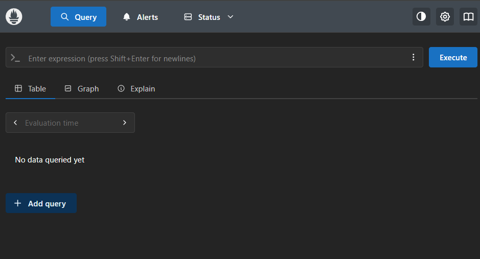

- В случае неполадок можно запустить команду docker logs prometheus. Там будет выведена ошибка, указывающая на причину неработающего контейнера. В случае обнаружения подобной ошибки рекомендуется попробовать починить ее самостоятельно.

Посмотрим логи:
```
.../introduction-in-web-tech/2026_2027-introduction-in-web-tech-U4125-shishkina_s_a/lab3$ docker logs prometheus
time=2026-09-14T12:17:31.223Z level=INFO source=main.go:1736 msg="updated GOGC" old=100 new=75
time=2026-09-14T12:17:31.224Z level=INFO source=main.go:795 msg="Leaving GOMAXPROCS=12: CPU quota undefined" component=automaxprocs
time=2026-09-14T12:17:31.224Z level=INFO source=memlimit.go:198 msg="GOMEMLIMIT is updated" component=automemlimit package=github.com/KimMachineGun/automemlimit/memlimit GOMEMLIMIT=7109218713 previous=9223372036854775807
time=2026-09-14T12:17:31.225Z level=INFO source=main.go:902 msg="Starting Prometheus Server" mode=server version="(version=3.14.0, branch=HEAD, revision=d7598b7141418fa35be2b5ec5d0fefb634199610)"
time=2026-09-14T12:17:31.225Z level=INFO source=main.go:907 msg="operational information" build_context="(go=go1.26.6, platform=linux/amd64, user=root@f423027f4410, date=20260817-16:49:19, tags=netgo,builtinassets)" host_details="(Linux 6.6.87.2-microsoft-standard-WSL2 #1 SMP PREEMPT_DYNAMIC Thu Jun  5 18:30:46 UTC 2025 x86_64 8f0ce25a3e2e localdomain)" fd_limits="(soft=1048576, hard=1048576)" vm_limits="(soft=unlimited, hard=unlimited)"
time=2026-09-14T12:17:31.367Z level=INFO source=web.go:727 msg="Start listening for connections" component=web address=0.0.0.0:9090
time=2026-09-14T12:17:31.378Z level=INFO source=main.go:1468 msg="Starting TSDB ..."
time=2026-09-14T12:17:31.380Z level=INFO source=tls_config.go:372 msg="Listening on" component=web address=[::]:9090
time=2026-09-14T12:17:31.380Z level=INFO source=tls_config.go:375 msg="TLS is disabled." component=web http2=false address=[::]:9090
time=2026-09-14T12:17:31.385Z level=INFO source=head.go:738 msg="Replaying on-disk memory mappable chunks if any" component=tsdb
time=2026-09-14T12:17:31.386Z level=INFO source=head.go:824 msg="On-disk memory mappable chunks replay completed" component=tsdb duration=1.483µs
time=2026-09-14T12:17:31.386Z level=INFO source=head.go:832 msg="Replaying WAL, this may take a while" component=tsdb
time=2026-09-14T12:17:31.388Z level=INFO source=head.go:927 msg="WAL segment loaded" component=tsdb segment=0 maxSegment=0 duration=1.772934ms
time=2026-09-14T12:17:31.388Z level=INFO source=head.go:964 msg="WAL replay completed" component=tsdb checkpoint_replay_duration=50.468µs wal_replay_duration=1.830979ms wbl_replay_duration=129ns chunk_snapshot_load_duration=0s mmap_chunk_replay_duration=1.483µs total_replay_duration=1.906018ms
time=2026-09-14T12:17:31.389Z level=INFO source=main.go:1489 msg="filesystem information" fs_type=EXT4_SUPER_MAGIC
time=2026-09-14T12:17:31.389Z level=INFO source=main.go:1492 msg="TSDB started"
time=2026-09-14T12:17:31.389Z level=INFO source=main.go:1690 msg="Loading configuration file" filename=/etc/prometheus/prometheus.yml
time=2026-09-14T12:17:31.391Z level=INFO source=main.go:1106 msg="TSDB retention updated" duration=8d8h size=0B percentage=0
time=2026-09-14T12:17:31.392Z level=INFO source=main.go:1729 msg="Completed loading of configuration file" db_storage=58.224µs remote_storage=2.061µs web_handler=657ns query_engine=1.095µs scrape=666.725µs scrape_sd=40.9µs notify=1.384µs notify_sd=657ns rules=1.553µs tracing=9.02µs filename=/etc/prometheus/prometheus.yml totalDuration=2.789938ms
time=2026-09-14T12:17:31.392Z level=INFO source=main.go:1453 msg="Server is ready to receive web requests."
time=2026-09-14T12:17:31.392Z level=INFO source=manager.go:211 msg="Starting rule manager..." component="rule manager"
```

Ошибок не видно - все логи имеют уровень INFO.

4. Запуск Grafana.

- Создать том для данных Grafana:
```
docker volume create grafana-data
```

Создадим том:
```
.../introduction-in-web-tech/2026_2027-introduction-in-web-tech-U4125-shishkina_s_a/lab3$ docker volume create grafana-data
grafana-data
```

- Запустить контейнер Grafana:
```
docker run -d \
      --name grafana \
      --network monitoring \
      --restart=unless-stopped \
      -p 3000:3000 \
      -v grafana-data:/var/lib/grafana \
      -e "GF_SECURITY_ADMIN_PASSWORD=admin" \
      grafana/grafana
```

Запустим контейнер:
```
.../introduction-in-web-tech/2026_2027-introduction-in-web-tech-U4125-shishkina_s_a/lab3$ docker run -d \
      --name grafana \
      --network monitoring \
      --restart=unless-stopped \
      -p 3000:3000 \
      -v grafana-data:/var/lib/grafana \
      -e "GF_SECURITY_ADMIN_PASSWORD=admin" \
      grafana/grafana
Unable to find image 'grafana/grafana:latest' locally
latest: Pulling from grafana/grafana
c3f38fea4531: Pull complete
24ad5a5d1b0c: Pull complete
55afa1ecc21d: Pull complete
d7788a257858: Pull complete
b3fa5aa4a9e5: Pull complete
ad2518ae2a48: Pull complete
b638a4802c9f: Pull complete
ccdc6a4758b3: Pull complete
157434f6599a: Pull complete
de3f16ec959b: Pull complete
4f4fb700ef54: Pull complete
Digest: sha256:f772d434e8fab0049deb2b1b30abd43342bcfca1537614aa8d36080232cf4283
Status: Downloaded newer image for grafana/grafana:latest
d57fb8fe35c6ea9e2702321de7a0f3e931067147eaf256d12754535a8df4bc31
```

- Проверить работу: открыть http://localhost:3000 в браузере (логин: admin, пароль: admin)

Результат проверки:

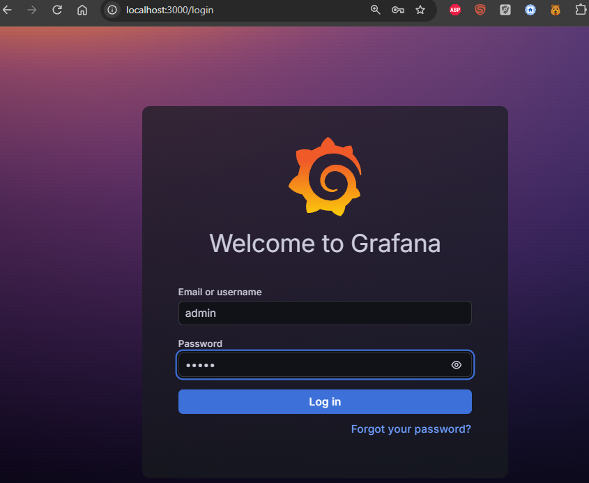
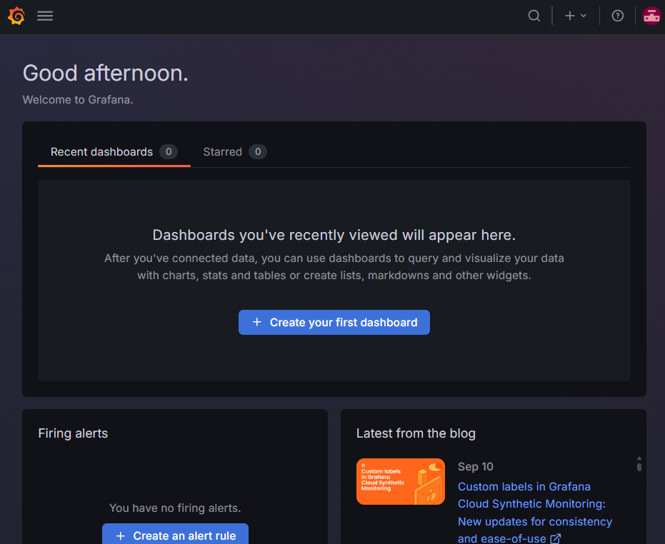

Контейнер с Grafana запустился, вход по логину и паролю сработал.

5. Настройка Grafana:
- Войти в Grafana (admin/admin)
    
  Уже сделано.

- Добавить источник данных Prometheus:
    - Configuration → Data Sources → Add data source
    - Выбрать Prometheus
    - URL: http://prometheus:9090
    - Save & Test

Проделаем описанные действия:

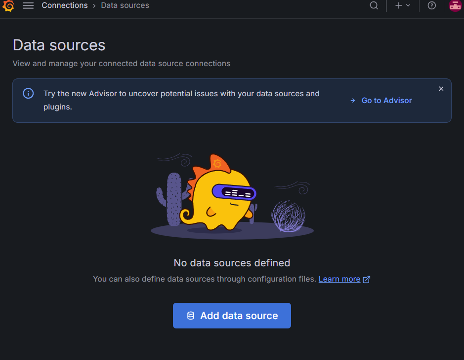
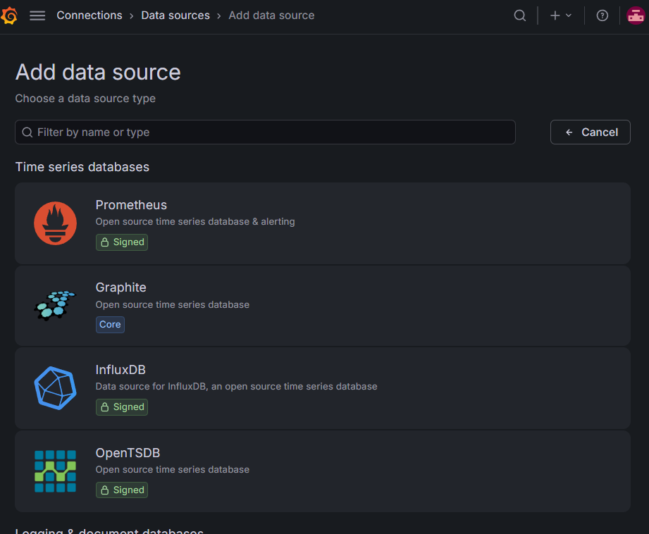
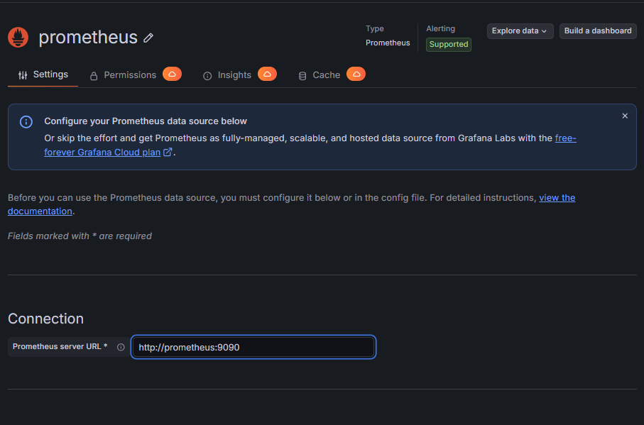
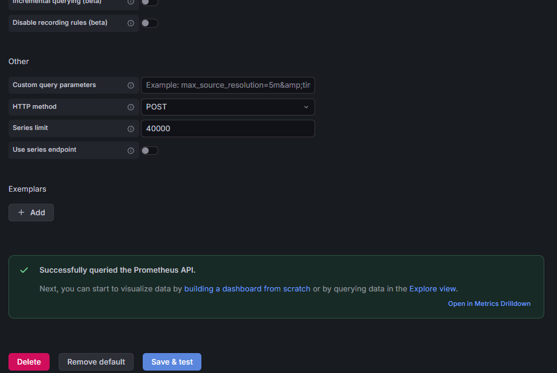

- Создать дашборд:
  - Create → Dashboard → Add visualization
  - Выбрать источник данных Prometheus
  - Добавить метрику: node_cpu_seconds_total
  - Сохранить дашборд

Проделаем описанные действия:

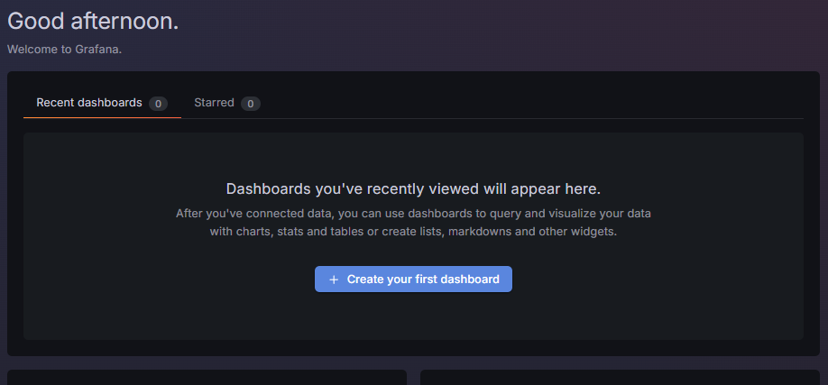
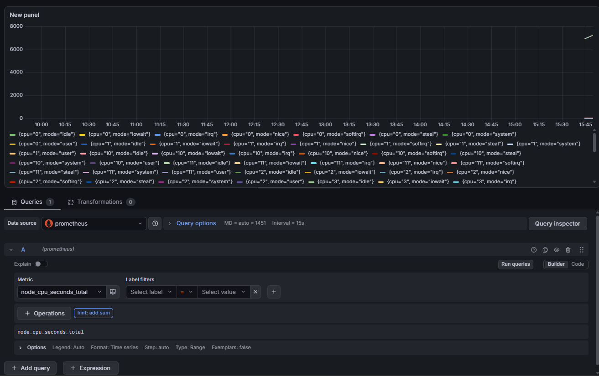

Метрика добавлена, графики строятся.

6. Тестирование системы:
- Проверить все контейнеры: `docker ps`:
Выполним команду:
```
.../introduction-in-web-tech/2026_2027-introduction-in-web-tech-U4125-shishkina_s_a/lab3$ docker ps
CONTAINER ID   IMAGE                COMMAND                  CREATED          STATUS          PORTS                                         NAMES
a033eccc7488   prom/node-exporter   "/bin/node_exporter …"   9 minutes ago    Up 9 minutes    0.0.0.0:9100->9100/tcp, [::]:9100->9100/tcp   node-exporter
d57fb8fe35c6   grafana/grafana      "/run.sh"                25 minutes ago   Up 25 minutes   0.0.0.0:3000->3000/tcp, [::]:3000->3000/tcp   grafana
8f0ce25a3e2e   prom/prometheus      "/bin/prometheus --c…"   35 minutes ago   Up 35 minutes   0.0.0.0:9090->9090/tcp, [::]:9090->9090/tcp   prometheus
```

Видим три контейнера - Node Exporter, Grafana и Prometheus.

- Открыть Prometheus и убедиться, что метрики собираются.

Откроем раздел http://localhost:9090/targets, тут видим, что метрики собираются:

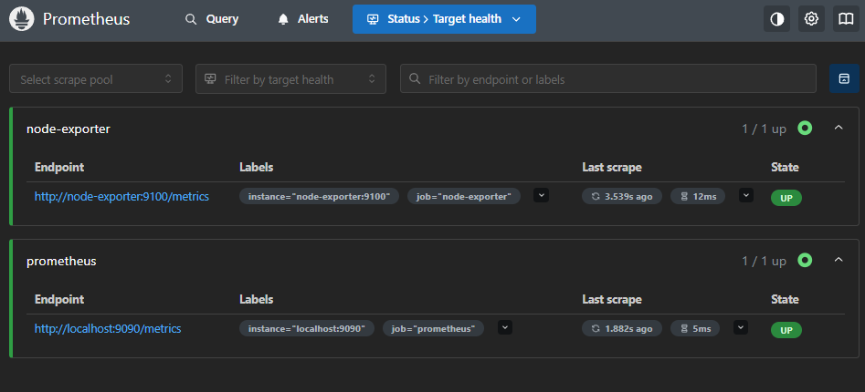

У node-exporter и prometheus статус UP. Last scrape показывает, что последний сбор был несколько секунд назад.

- Открыть Grafana и проверить отображение графиков:

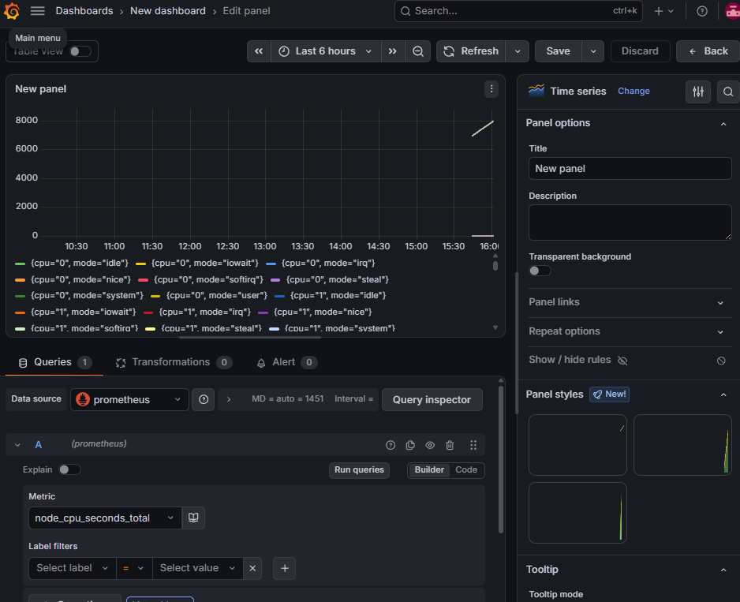

- Создать несколько графиков для разных метрик (CPU, память, диск).

Для этого создадим ещё несколько визуализаций в Grafana. В качестве названий метрик возьмём, например, `node_memory_Active_bytes` (сколько байт оперативной памяти активно) и `node_disk_read_bytes_total` (сколько всего байт было прочитано диском).

Итоговый дашборд выглядит так:

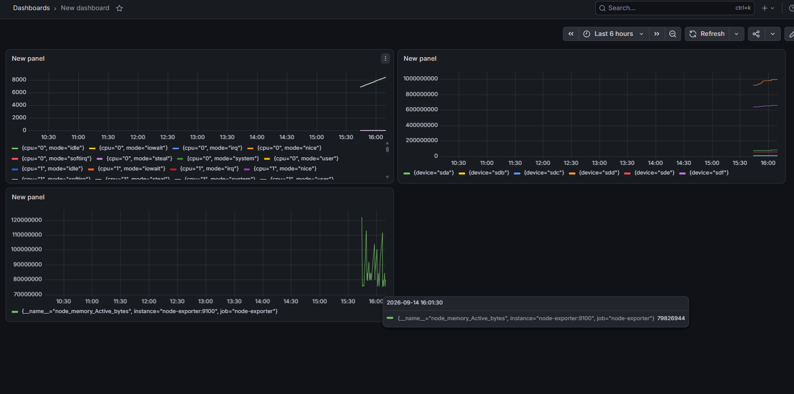


